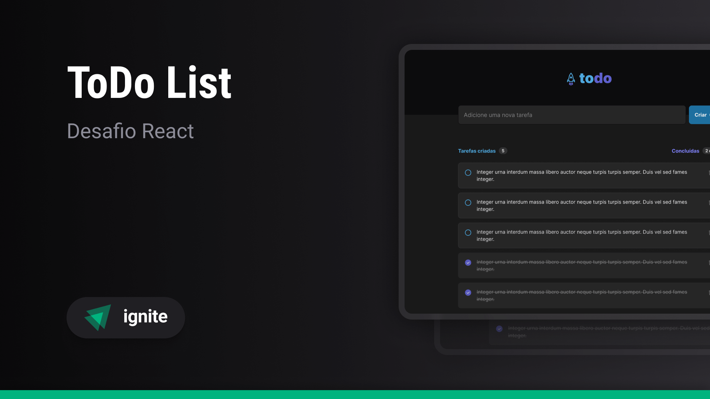

> Ignite/2023 - Desafio #1

# Todo List

## Sobre o desafio

Nesse desafio, foi desenvolvida uma aplicação de controle de tarefas no estilo **todo list**, que contém as seguintes funcionalidades:

- adicionar uma nova tarefa
- marcar e desmarcar uma tarefa como concluída
- remover uma tarefa da listagem
- mostrar o progresso de conclusão das tarefas

## O que foi sugerido

- React
- TypeScript
- Vite
- Sass

## O que foi acrescentado
- Eslint
- Prettier
- Stylelint
